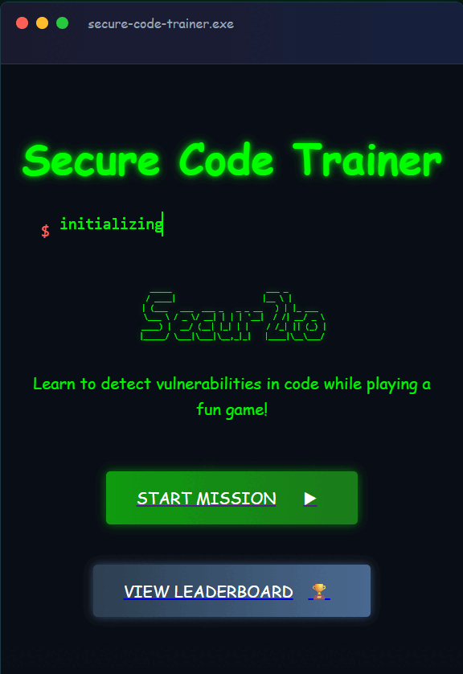

# 🔐 Secure Code Trainer

**Secure Code Trainer** is an interactive Python + React game to practise secure coding.  
You’ll be shown Python functions and must decide whether they are **vulnerable** or **safe**.  
Earn points for correct answers, and if you're wrong, you'll learn why and see a secure version.

---

## 🚀 Quick Start

### 🧠 Step 1 — Start the Backend (FastAPI)

```bash
cd backend
python3 -m venv venv
source venv/bin/activate
pip install -r requirements.txt
python main.py
```

Backend will run at: [http://localhost:8000](http://localhost:8000)

---

### ⚙️ Step 2 — Configure the Frontend (React)

```bash
cd ../frontend
npm install
cp .env.example .env
```

Update `.env` with the following line:

```env
REACT_APP_API_URL=http://localhost:8000
```

---

### 🟢 Step 3 — Start the Frontend

```bash
npm start
```

Frontend will run at: [http://localhost:3000](http://localhost:3000)

---

## 📡 API Endpoints

| Method | Endpoint              | Description                                |
|--------|-----------------------|--------------------------------------------|
| GET    | `/`                   | Health check                               |
| GET    | `/game/question`      | Get a random Python function               |
| POST   | `/game/answer`        | Submit answer and receive feedback         |
| GET    | `/game/score`         | Get current score for a nickname           |
| GET    | `/leaderboard`        | Get top scores                             |
| POST   | `/leaderboard/update` | Add or update a player's score             |

---

## 📄 License

This project is licensed under the [MIT License](./LICENSE).

---

<p align="center">
  
</p>

Feel free to collaborate and let's take it to the next level.

